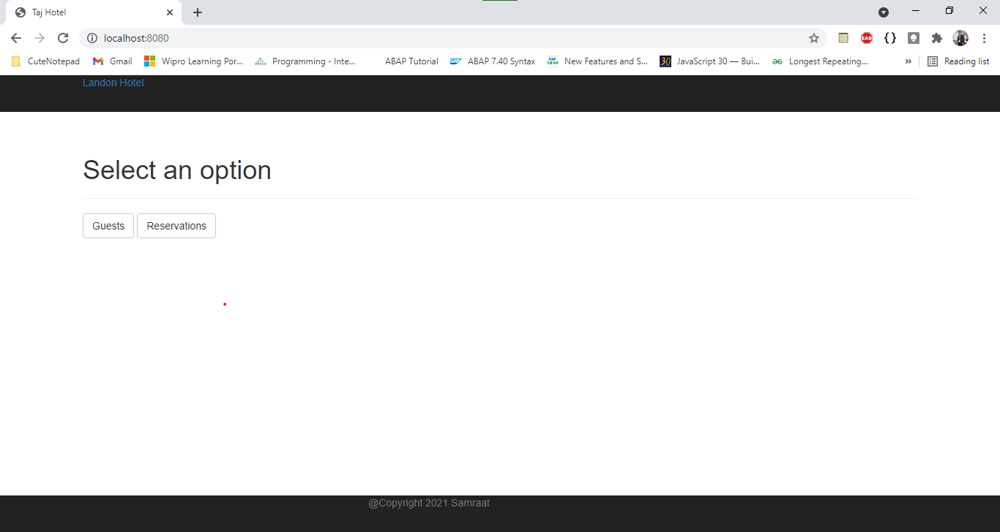
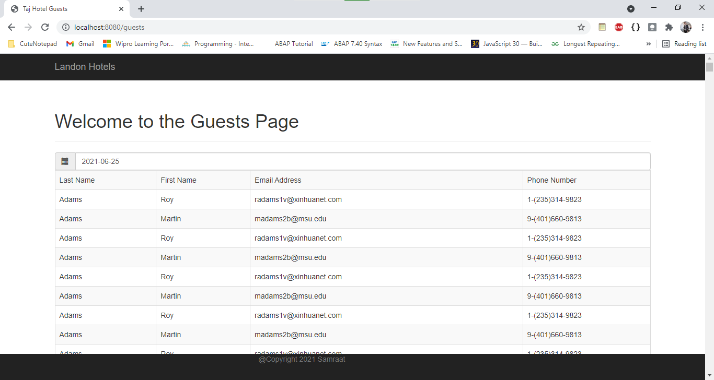
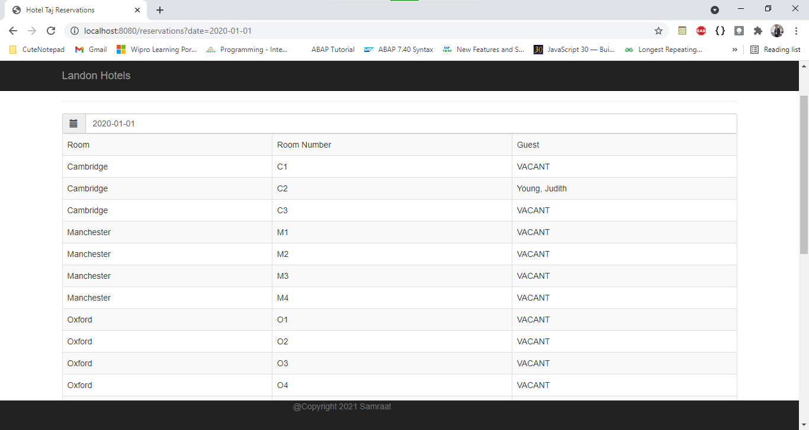

# HotelApi
Just finished the course “Learning Spring with Spring Boot” where I understood the basics of spring boot by creating the Rest API of Hotel booking Service in here I was introduced to Docker containers and their working on windows, also I used an external database PostgreSQL.
Used the MVC model for creating codebase.

